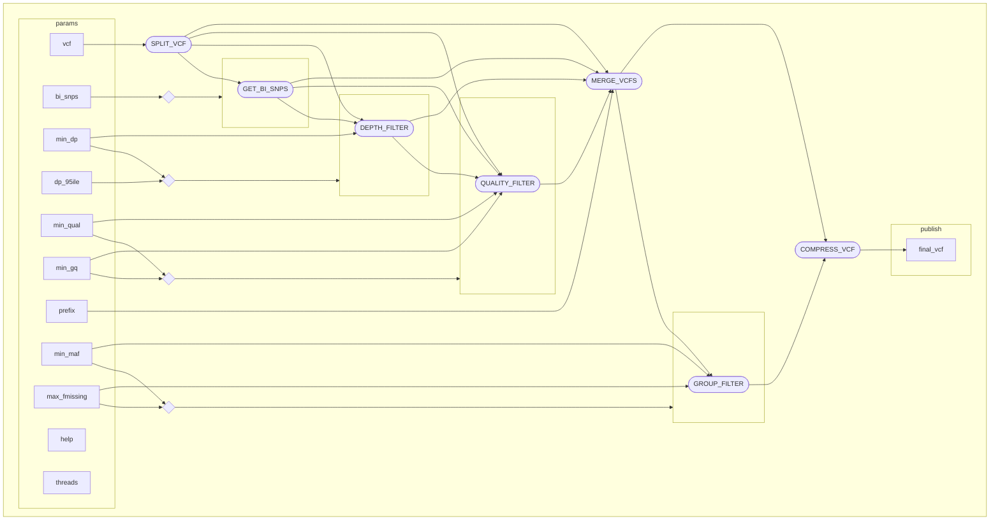

# `OikosFilt`
A [NextFlow](https://www.nextflow.io/docs/latest/index.html)-enabled pipeline intended to streamline SNP discovery for `.vcf` files, with a focus on population genetics analysis.
Takes a single `.vcf` file as input (zipped or unzipped), along with user-designated filtering parameters, and outputs a single `.vcf.gz` file.
Upcoming versions will also output a `tsv` reporting variants removed after every step.

## Quickstart

The pipeline can be run on default filter parameters with the following command:

```
nextflow run OikosFilt.nf --vcf <input.vcf.gz> --prefix <output_prefix>
```

- `--vcf` is the path to your variant file.
  - Mandatory
  - Can be compressed or uncompressed.
- `--prefix` is the name of the output files.
  - Optional
  - Defaults to `out`

## Options

All native options in `NextFlow` are usable in `OikosFilt` - their documentation can be found [here](https://www.nextflow.io/docs/latest/cli.html).
`-with-trace` and `-with-report` are useful for providing usage stats, and the author recommends enabling them.
The following table documents all options specific to `OikosMap`:

| Option | Default | Data type | Description |
| -- | -- | -- | -- |
| `--help`/`-h`  | `FALSE` | Flag | Print a help message and exit. |
| `--vcf`/`-v` | `null` | String | Path to the variant file to be filtered. |
| `--prefix`/`-pre` | `out` | String | Name of your output vcf. |
| `--threads`/`-t` | `nproc/2` | Int | Number of threads available to the program. Defaults to $\frac{1}{2}$ the number on the host machine. |
| `--bi_snps`/`-bi` | `TRUE` | Flag | Whether or not remove indels and multiallelic SNPs. Evaluated per individual per site. |
| `--dp_95ile`/`-d95` | `TRUE` | Flag | Whether or not remove sites with a depth score lower than the `2.5%ile` OR higher than the `97.5ile`. Evaluated per individual per site. |
| `--min_dp`/`-md` | `10` | Int | Minimum depth allowed in the file, per individual per site. Evaluated per individual per site, *after* `--dp_95ile`. Set to `null` to disable. |
| `--min_qual`/`-mq` | `20` | Int | Minimum per-site SNP quality (QUAL) allowed in the file. Evaluated per individual per site. Set to `null` to disable. |
| `--min_gq`/`-mgq` | `20` | Int | Minimum genotype quality (GQ) allowed in the file. Evaluated per individual per site. Set to `null` to disable. |
| `--min_maf`/`-mm` | `0.03` | Float | Minimum minor allele frequency (MAF) allowed in the file. Evaluated per site. Set to `null` to disable. |
| `--max_fmiss_ind`/`-fmi` | `0.1` | Float | Maximum proportion of missing data allowed per individual across all sites. |
| `--max_fmiss_site`/`-fms` | `0.1` | Float | Maximum proportion of missing data allowed across all individuals at a given site. Evaluated per site. |

## High-level Description

### Default filtering parameters

`OikosFilt` initially removes indels and multiallelic SNPs using [`bcftools`](https://github.com/samtools/bcftools?tab=readme-ov-file).
It then filters based on depth, initially removing the 
It then writes results to a final output directory (`${prefix}_results/`) for the end-user to consume.

By default, this removes both indels and sites with outside of the [95 percentile](https://en.wikipedia.org/wiki/Percentile) of depth distribution, with a minimum depth of 10.
It also enforces a minimum [per-site SNP quality (QUAL) and genotype quality (GQ)](http://barcwiki.wi.mit.edu/wiki/SOPs/vcf) of 20 to all sites and individuals.
For VCFs where there is more than one individual, it also removes sites where the [minor allele frequency (MAF)](https://en.wikipedia.org/wiki/Minor_allele_frequency) is less than 3%, and more than 10% of the data is missing across all individuals.

These parameters are a reasonable starting point, but will not be suitable for all projects.

### Outputs
OikosFilt produces two main outputs - a filtered `.vcf` and a `csv` summary file.
All outputs are written to `${prefix}_results/` in your working directory.

| Name | Description | Path |
| -- | -- | -- |
| Filtered VCF | VCF filtered according to your filtering parameters. | `${prefix}_results/${prefix}.vcf.gz` |
| Summary file | `csv` containing the number of variants removed by each filter step. | `${prefix}_results/${prefix}_variants_removed.csv` |

### Flowchart


## Known limitations

## Installation and requirements

### Installation

The pipeline includes two dependencies: [NextFlow](https://www.nextflow.io/docs/latest/getstarted.html), and [Conda](https://conda.io/projects/conda/en/latest/user-guide/install/index.html).
You will need to install both of these for the pipeline to run.
[Docker](https://docs.docker.com/engine/install/) and [Singularity](https://docs.sylabs.io/guides/3.5/user-guide/introduction.html) are not currently supported.


### Requirements

The `OikosMap` pipeline is undemanding, and will run on effectively any Linux environment.
It does not require GPU support.

## Runtime

Overall runtime scales roughly linearly with input data volume.

## DAG


